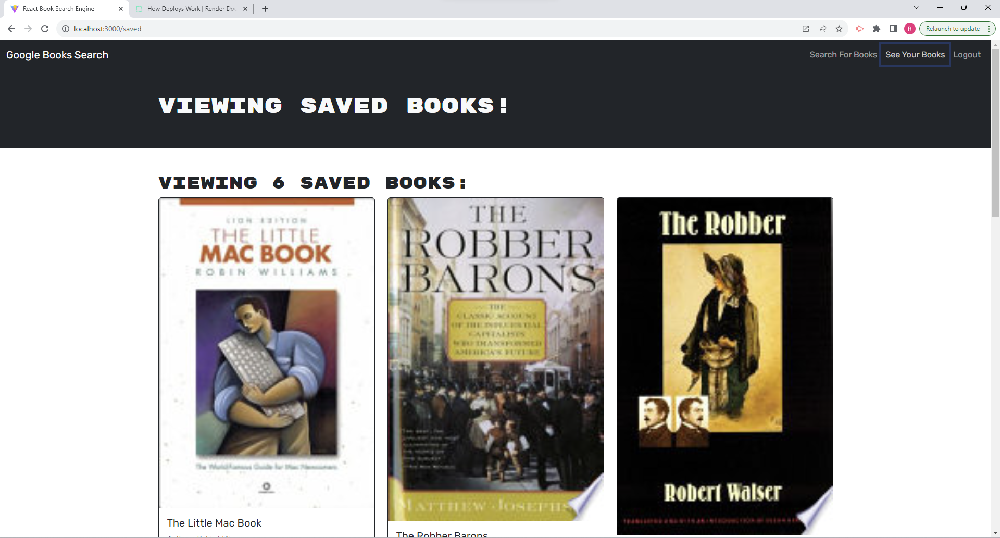

# Book Finder

  ## License
  
  
  
    

## Description
This full-stack application allows users to search for books, view details about them, and save their favorite books to their profile. The app features user authentication and utilizes the Google Books API to fetch book data.

## Table of Contents
- [Installation](#installation)
- [Usage](#usage)
- [License](#license)
- [Contributing](#contributing)
- [Technologies Used](#technologies)
- [Questions](#questions)
- [Screenshots](#screenshots)
- [Links](#links)

## Installation
* git clone <repository-url>
  cd bookfinder
  npm install

Start the Application:
* npm run dev
  npm start

## Usage
 How to Use
* Clone the repository: git clone <repository-url>
* Navigate to the project directory.
* Install dependencies: npm run install
* Start the application:
* For development: npm run dev
* For production: npm start

## Contributing
* boot camp spot 
* teacher and TA's
* students 
* google 
## Technologies
Frontend
 * React.js
 * Apollo Client
 * GraphQL

Backend
* Node.js
* Express.js
* Apollo Server
* GraphQL
* MongoDB

Authentication
* JSON Web Tokens (JWT)
* bcrypt

Other
* Mongoose
* Concurrently
* Nodemon

## Screenshots

1. 
   Home Page

2. 
   Saved Books

## Links

- [Live Demo](https://your-project-demo.com)
- [GitHub Repository](https://github.com/2dogsandaguy/book-finder)

## Questions
If you have any questions about the project, you can reach me via email at [neverclear@ymail.com]
neverclear@ymail.com. Feel free to ask any additional questions or provide feedback.
GitHub: [2dogsandaguy](https://github.com/2dogsandaguy)
Email: [neverclear@ymail.com](mailto:neverclear@ymail.com)
  